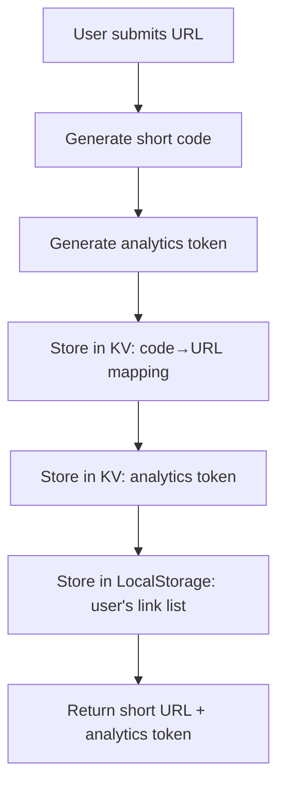
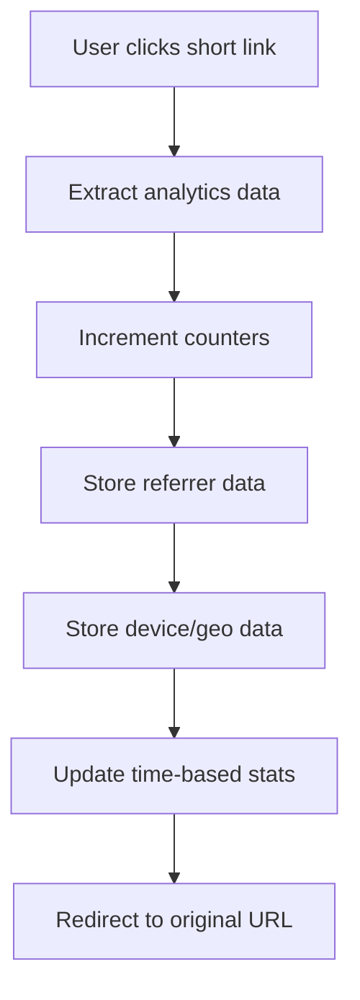
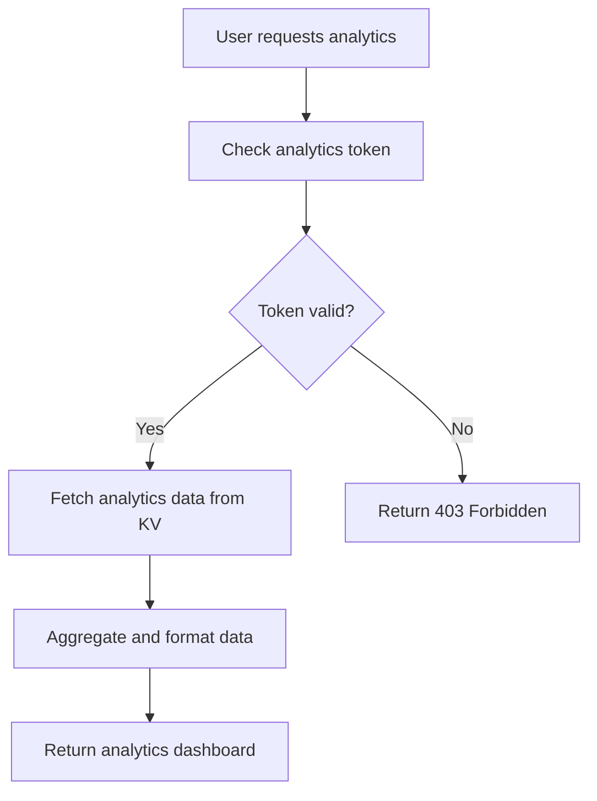

# Link Shortener Analytics Architecture
## KV Storage + LocalStorage + Token-Based Approach

### Overview
This document outlines the hybrid analytics architecture for the qubex.it link shortener that provides secure, user-friendly analytics tracking without requiring a traditional database or complex authentication system.

## Architecture Components

### 1. **Vercel KV Storage** (Primary Data Store)
- **Purpose**: Store link mappings, analytics data, and access tokens
- **Technology**: Redis-based key-value store
- **Advantages**: Fast, serverless-native, cost-effective

### 2. **Browser LocalStorage** (User Interface Layer)
- **Purpose**: Store user's link collection for convenience
- **Technology**: Browser's localStorage API
- **Advantages**: No server dependency, instant access, offline capability

### 3. **Analytics Tokens** (Security Layer)
- **Purpose**: Secure access control for analytics data
- **Technology**: Cryptographically secure random tokens
- **Advantages**: No authentication complexity, shareable access

## Data Architecture

### KV Storage Schema

```javascript
// Link mappings (existing)
"link-shortening-test:code:abc123" → "https://example.com"
"link-shortening-test:url:https://example.com" → "abc123"

// Analytics tokens (new)
"analytics-token:abc123" → "xyz789secure32chartoken456def"

// Link metadata (new)
"analytics:abc123:meta" → {
  url: "https://example.com",
  created: "2024-01-15T10:30:00Z",
  title: "Example Website",
  creator_ip_hash: "hash123" // for basic spam prevention
}

// Click tracking (new)
"analytics:abc123:clicks:total" → 1547
"analytics:abc123:clicks:unique" → 892
"analytics:abc123:clicks:today" → 23

// Time-based analytics (new)
"analytics:abc123:daily:2024-01-15" → 23
"analytics:abc123:daily:2024-01-16" → 31
"analytics:abc123:weekly:2024-W03" → 156
"analytics:abc123:monthly:2024-01" → 678

// Referrer tracking (new)
"analytics:abc123:referrers" → {
  "google.com": 245,
  "facebook.com": 123,
  "twitter.com": 89,
  "direct": 156
}

// Geographic data (new)
"analytics:abc123:countries" → {
  "US": 456,
  "UK": 234,
  "CA": 123,
  "DE": 89
}

// Device/Browser data (new)
"analytics:abc123:devices" → {
  "mobile": 567,
  "desktop": 432,
  "tablet": 78
}

"analytics:abc123:browsers" → {
  "chrome": 678,
  "safari": 234,
  "firefox": 123,
  "edge": 89
}

// UTM tracking (new)
"analytics:abc123:utm:source" → {
  "facebook": 123,
  "google": 234,
  "email": 67
}

"analytics:abc123:utm:medium" → {
  "cpc": 189,
  "organic": 234,
  "email": 67
}
```

### LocalStorage Schema

```javascript
// Stored in user's browser
"qubex_user_links" → [
  {
    shortCode: "abc123",
    analyticsToken: "xyz789secure32chartoken456def",
    originalUrl: "https://example.com",
    title: "Example Website",
    created: "2024-01-15T10:30:00Z",
    lastViewed: "2024-01-16T14:20:00Z"
  },
  // ... more links
]

// User preferences
"qubex_user_preferences" → {
  theme: "dark",
  defaultExpiry: "1year",
  analyticsLevel: "detailed"
}
```

## Technical Flow

### 1. **Link Creation Process**



**Implementation:**
```javascript
// In /api/shorten.js
const shortCode = generateShortCode();
const analyticsToken = generateSecureToken(32);

// Store mappings
await kv.set(`${DATABASE_NAME}:code:${shortCode}`, url);
await kv.set(`analytics-token:${shortCode}`, analyticsToken);

// Initialize analytics metadata
await kv.set(`analytics:${shortCode}:meta`, {
  url,
  created: new Date().toISOString(),
  title: await extractTitle(url), // Optional: fetch page title
  creator_ip_hash: hashIP(req.ip)
});

// Return to frontend with token
return {
  shortUrl: `https://qubex.it/${shortCode}`,
  shortCode,
  analyticsToken,
  originalUrl: url
};
```

### 2. **Click Tracking Process**



**Implementation:**
```javascript
// In /api/[shortCode].js
export default async function handler(req, res) {
  const { shortCode } = req.query;
  
  // Get original URL
  const originalUrl = await kv.get(`${DATABASE_NAME}:code:${shortCode}`);
  
  if (originalUrl) {
    // Track analytics (fire-and-forget)
    trackClick(shortCode, req).catch(console.error);
    
    // Immediate redirect
    return res.redirect(302, originalUrl);
  }
  
  return res.status(404).json({ error: 'Not found' });
}

async function trackClick(shortCode, req) {
  const today = new Date().toISOString().split('T')[0];
  const userAgent = req.headers['user-agent'];
  const referrer = req.headers.referer || 'direct';
  const ip = req.headers['x-forwarded-for'] || req.connection.remoteAddress;
  
  // Increment counters
  await kv.incr(`analytics:${shortCode}:clicks:total`);
  await kv.incr(`analytics:${shortCode}:clicks:today`);
  await kv.incr(`analytics:${shortCode}:daily:${today}`);
  
  // Track unique clicks (simplified with IP hash)
  const ipHash = hashIP(ip);
  const uniqueKey = `analytics:${shortCode}:unique:${ipHash}`;
  const isUnique = !(await kv.get(uniqueKey));
  
  if (isUnique) {
    await kv.set(uniqueKey, true, { ex: 86400 }); // 24h expiry
    await kv.incr(`analytics:${shortCode}:clicks:unique`);
  }
  
  // Update referrer stats
  const referrerDomain = extractDomain(referrer);
  await kv.hincrby(`analytics:${shortCode}:referrers`, referrerDomain, 1);
  
  // Device detection
  const deviceInfo = parseUserAgent(userAgent);
  await kv.hincrby(`analytics:${shortCode}:devices`, deviceInfo.type, 1);
  await kv.hincrby(`analytics:${shortCode}:browsers`, deviceInfo.browser, 1);
  
  // Geo tracking (if enabled)
  if (ip) {
    const geoData = await getGeoData(ip);
    await kv.hincrby(`analytics:${shortCode}:countries`, geoData.country, 1);
  }
}
```

### 3. **Analytics Access Process**



**Implementation:**
```javascript
// In /api/analytics/[shortCode].js
export default async function handler(req, res) {
  const { shortCode } = req.query;
  const { token } = req.query; // or req.headers.authorization
  
  // Verify analytics token
  const validToken = await kv.get(`analytics-token:${shortCode}`);
  if (!validToken || validToken !== token) {
    return res.status(403).json({ error: 'Invalid analytics token' });
  }
  
  // Fetch all analytics data
  const analytics = await fetchAnalyticsData(shortCode);
  
  return res.json(analytics);
}

async function fetchAnalyticsData(shortCode) {
  const [
    meta,
    totalClicks,
    uniqueClicks,
    referrers,
    countries,
    devices,
    browsers
  ] = await Promise.all([
    kv.get(`analytics:${shortCode}:meta`),
    kv.get(`analytics:${shortCode}:clicks:total`) || 0,
    kv.get(`analytics:${shortCode}:clicks:unique`) || 0,
    kv.hgetall(`analytics:${shortCode}:referrers`) || {},
    kv.hgetall(`analytics:${shortCode}:countries`) || {},
    kv.hgetall(`analytics:${shortCode}:devices`) || {},
    kv.hgetall(`analytics:${shortCode}:browsers`) || {}
  ]);
  
  // Get daily data for last 30 days
  const dailyData = await fetchDailyData(shortCode, 30);
  
  return {
    meta,
    summary: {
      totalClicks,
      uniqueClicks,
      clickThroughRate: uniqueClicks / totalClicks
    },
    referrers,
    geography: countries,
    devices,
    browsers,
    timeline: dailyData
  };
}
```

## Security Considerations

### 1. **Token Security**
- **Generation**: Use cryptographically secure random tokens (32+ characters)
- **Storage**: Store tokens in KV with expiration (optional)
- **Transmission**: Always use HTTPS for token transmission
- **Scope**: Tokens only grant access to specific link analytics

### 2. **Privacy Protection**
- **IP Hashing**: Store hashed IPs, not raw IPs
- **Data Retention**: Implement automatic data expiry
- **Anonymization**: Aggregate data to prevent individual tracking

### 3. **Rate Limiting**
- **Analytics API**: Limit requests per token per minute
- **Click Tracking**: Prevent spam clicks from same IP

## User Experience Flow

### 1. **Link Creation**
1. User enters URL in shortener
2. System generates short link + analytics token
3. Frontend stores link info in localStorage
4. User receives short link and analytics access

### 2. **Analytics Access**
1. User visits "My Links" page
2. Frontend loads links from localStorage
3. User clicks "View Analytics" for a link
4. Frontend requests analytics using stored token
5. Dashboard displays comprehensive analytics

### 3. **Link Management**
1. User can export link list as JSON/CSV
2. User can import previously exported links
3. User can share analytics access via token
4. User can delete links from their local list

## Why Database is Not Necessary

### Current Requirements Analysis

**✅ What we need:**
- Link shortening and redirection
- Click tracking and analytics
- User access to their link analytics
- Export capabilities
- Basic security

**❌ What we don't need (yet):**
- User accounts and authentication
- Team collaboration
- Complex queries and reporting
- Real-time dashboards
- A/B testing
- Bulk operations on thousands of links

### KV Storage Advantages for Current Scope

1. **Performance**: Redis-based KV is faster than SQL for simple operations
2. **Scalability**: Handles high read/write loads without optimization
3. **Simplicity**: No schema migrations, no query optimization
4. **Cost**: Vercel KV free tier is generous for startup usage
5. **Maintenance**: Zero database administration overhead

### When to Consider Database Migration

Consider PostgreSQL/MySQL when you need:
- **User accounts** with login/registration
- **Complex analytics queries** (custom date ranges, filters)
- **Team features** (shared link management)
- **Advanced reporting** (cohort analysis, funnel tracking)
- **Compliance requirements** (GDPR data export/deletion)
- **Scale beyond KV limits** (millions of links)

### Migration Path

The current architecture provides a clean migration path:
1. **Phase 1**: Current KV + localStorage approach
2. **Phase 2**: Add optional user accounts (KV + simple auth)
3. **Phase 3**: Migrate to PostgreSQL when complexity demands it

## Implementation Priority

### Phase 1: Core Analytics (Week 1-2)
- [ ] Modify redirect function to track clicks
- [ ] Implement analytics token generation
- [ ] Create basic analytics API endpoint
- [ ] Build simple analytics dashboard

### Phase 2: Enhanced Tracking (Week 3-4)
- [ ] Add device/browser detection
- [ ] Implement geo-location tracking
- [ ] Add referrer analysis
- [ ] Create time-based analytics

### Phase 3: User Experience (Week 5-6)
- [ ] Build "My Links" management page
- [ ] Add export/import functionality
- [ ] Implement analytics sharing
- [ ] Create mobile-responsive dashboard

### Phase 4: Advanced Features (Week 7-8)
- [ ] UTM parameter tracking
- [ ] Preview pages for SEO
- [ ] Advanced chart visualizations
- [ ] Performance optimizations

## Conclusion

This hybrid approach using KV storage, localStorage, and analytics tokens provides:

- ✅ **Secure analytics access** without complex authentication
- ✅ **User-friendly experience** with browser-based link management
- ✅ **Scalable architecture** that grows with your needs
- ✅ **Cost-effective solution** using existing infrastructure
- ✅ **Future-proof design** with clear migration path

The approach balances security, usability, and technical simplicity while avoiding premature optimization with a full database system.
